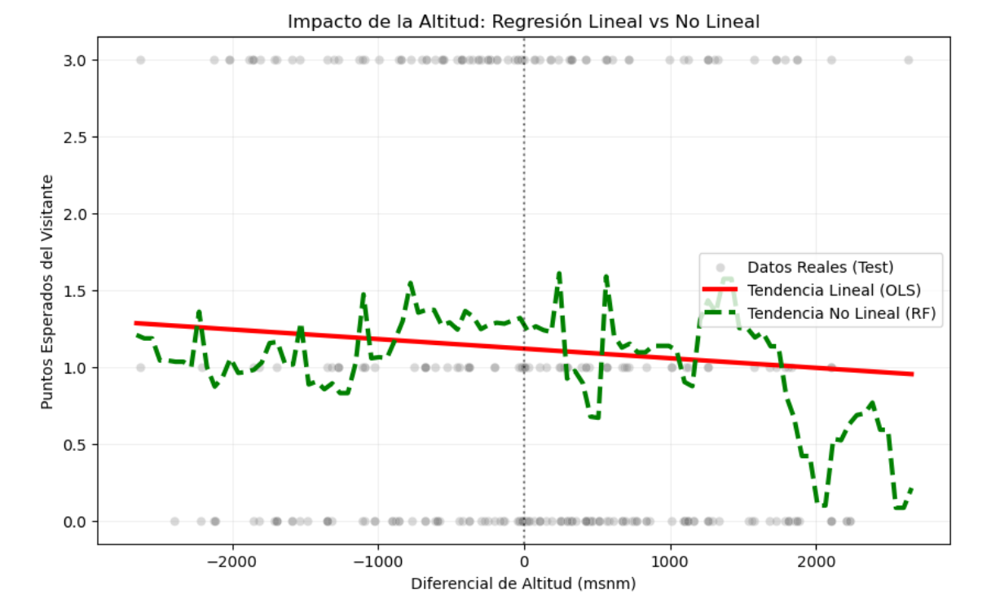
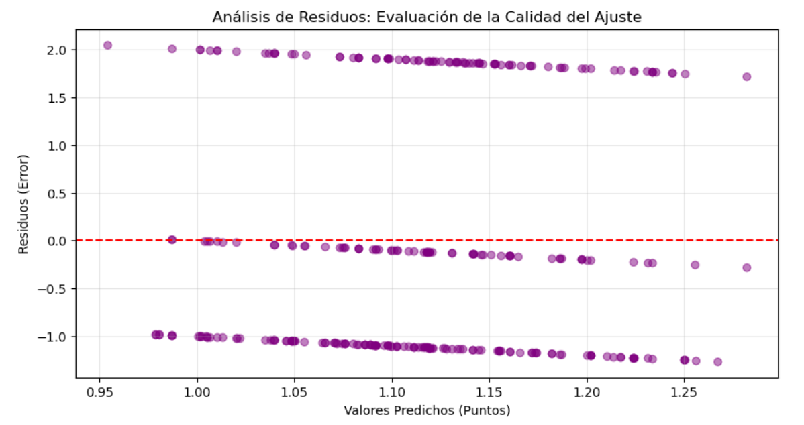

# ⚽ Impacto de la Altitud en la Liga MX | Altitude Impact Analysis

<p align="center">
  
  
  
  
</p>

---

## 🌎 Choose your language / Seleccione su idioma / Escolha seu idioma

<details>
<summary><b>English (EN-US)</b></summary>

### 📌 Project Overview
A comprehensive study on the "Altitude Effect" in Mexican professional football (Liga MX). By analyzing match results from 2021 to 2025, this project leverages **Machine Learning** to quantify how elevation changes affect athletic performance and match outcomes.

### 📈 Technical Highlights
* **The "Oxygen Tax":** Our model reveals a loss of **0.062 points** for every 1,000 meters of altitude gain for the away team.
* **Significance:** Validated with a **p-value of 0.0440**, meeting academic standards for statistical reliability.
* **International Standards:** Our findings align with global research (McSharry, 2007) indicating a performance drop in high-altitude environments.
* **Geographic Dominance:** 66.7% of recent titles were won by teams based above 2,000 meters.

### 🔗 File Access
* 📓 [Full Technical Analysis (Notebook)](./ImpactoAltitudLigaMX.ipynb)
* 📊 [Match Database (CSV)](./matches_LigaMX20212025.csv)
* 📄 [Reference Study - McSharry (PDF)](https://pmc.ncbi.nlm.nih.gov/articles/PMC2151172/pdf/bmj-335-7633-sport-01278.pdf)
</details>

<details>
<summary><b>Español (ES-MX)</b></summary>

### 📌 Descripción del Proyecto
Este estudio investiga la influencia del diferencial de altitud en el rendimiento de los equipos visitantes en la Liga MX durante el periodo 2021-2025. El proyecto utiliza modelos de **Inteligencia Artificial** para cuantificar el impacto fisiológico y competitivo de la hipoxia en el fútbol profesional mexicano.

### 📊 Hallazgos de la Investigación
* **Significancia Estadística:** El análisis de regresión arrojó un **p-value de 0.0440**, validando que la altitud es un factor determinante.
* **El "Impuesto del Oxígeno":** Se cuantificó una pérdida de **0.062 puntos** por cada 1,000m de ascenso respecto a la base del equipo.
* **Dominio Geográfico:** El **66.7%** de los títulos recientes fueron conquistados por equipos situados por encima de los 2,000 msnm.

### 📓 Acceso Directo
* 📓 [Análisis Completo (Notebook)](./ImpactoAltitudLigaMX.ipynb)
* 📊 [Base de Datos Curada (CSV)](./matches_LigaMX20212025.csv)
* 📄 [Validación con Estudio McSharry (PDF)](https://pmc.ncbi.nlm.nih.gov/articles/PMC2151172/pdf/bmj-335-7633-sport-01278.pdf)
</details>

<details>
<summary><b>Português (PT-BR)</b></summary>

### 📌 Sobre o Projeto
Análise avançada de dados sobre como o diferencial de altitude influencia os resultados da Liga MX (México). Desenvolvido durante meu intercâmbio acadêmico na **Universidad de Monterrey (UDEM)**, este projeto une fisiologia esportiva e modelos preditivos de **IA**.

### 🔬 Metodologia e Resultados
* **Modelo de Regressão:** Implementação de Regressão Linear e Random Forest para isolar a variável de altitude.
* **Impacto Mensurável:** Demonstrou-se que times de baixa altitude perdem cerca de **12%** de sua expectativa de pontos ao enfrentar o "choque geográfico" (ex: Monterrey visitando Toluca).
* **P-value de 0.0440:** Confirmando a altitude como um fator físico mensurável e estatisticamente significativo.

### 📂 Links do Repositório
* 📓 [Notebook de Análise](./ImpactoAltitudLigaMX.ipynb)
* 📊 [Dataset Processado (CSV)](./matches_LigaMX20212025.csv)
* 📄 [Estudo de Referência - McSharry (PDF)](https://pmc.ncbi.nlm.nih.gov/articles/PMC2151172/pdf/bmj-335-7633-sport-01278.pdf)
</details>

---

## 🖼️ Visualizaciones / Visualizations / Visualizações

### 1. Linear Regression | Modelo de Regresión Lineal | Regressão Linear

* *EN: Negative correlation between altitude differential and points obtained.*
* *ES: Correlación negativa entre el diferencial de altitud y la obtención de puntos.*
* *PT: Correlação negativa entre o diferencial de altitude e a obtenção de pontos.*

### 2. Residual Analysis | Análisis de Residuos | Análise de Resíduos

* *EN: Validation of the statistical model's fit quality.*
* *ES: Validación de la calidad del ajuste del modelo estadístico.*
* *PT: Validação da qualidade do ajuste do modelo estatístico.*

---

## 🛠️ Tech Stack | Stack Tecnológico
- **Language:** Python 3.x
- **Libraries:** - `Pandas` & `Numpy`: Data manipulation.
    - `Scikit-learn`: Random Forest Regressor.
    - `Statsmodels`: OLS Regression & p-value analysis.
    - `Matplotlib` & `Seaborn`: Data visualization.

## ⚙️ Configuración / Setup / Instalação
```bash
# Clone the repository | Clonar el repositorio
git clone [https://github.com/SEU_USUARIO/NOME_DO_REPO.git](https://github.com/SEU_USUARIO/NOME_DO_REPO.git)

# Install dependencies | Instalar dependencias
pip install -r requirements.txt
