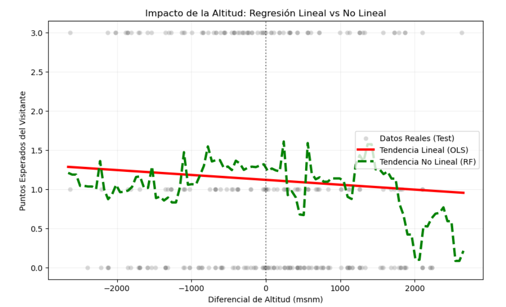
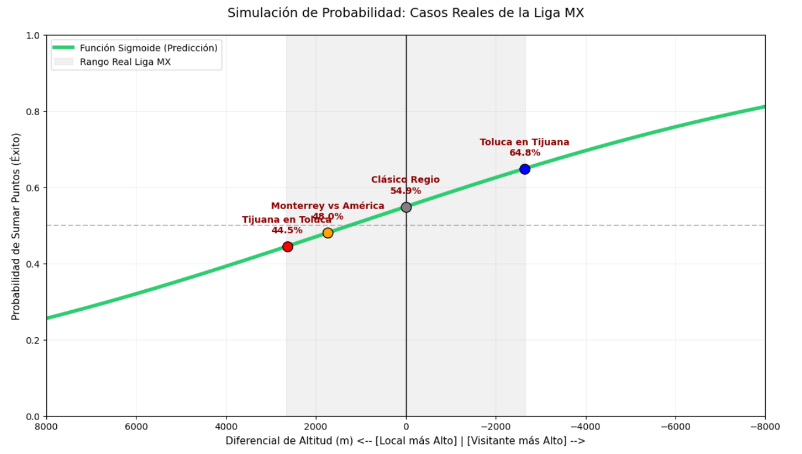
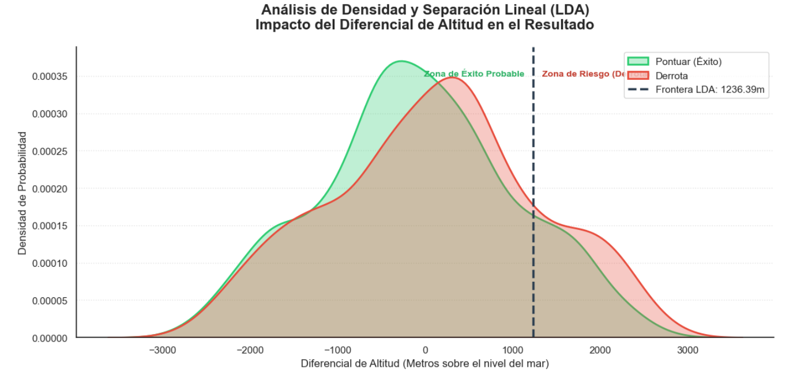
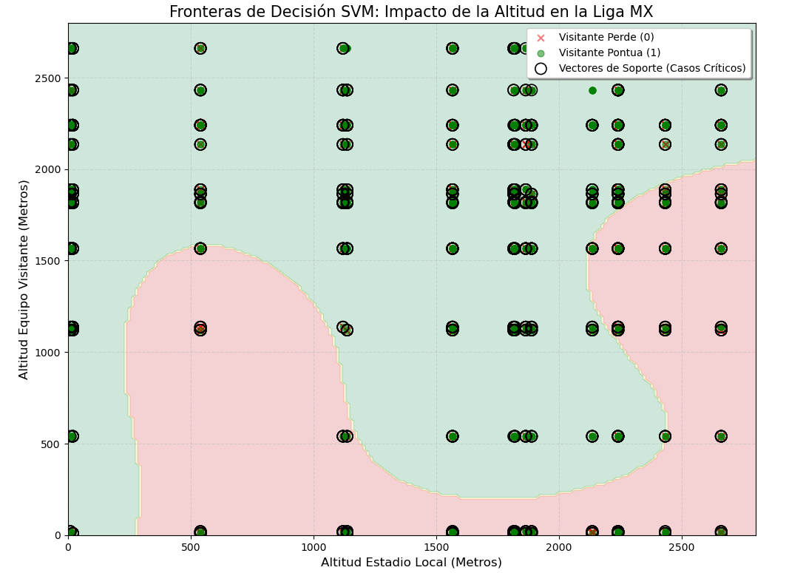
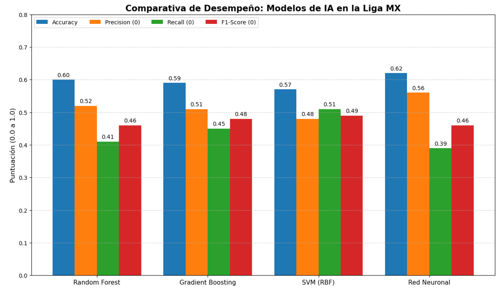

<p align="center">
  
</p>

<h1 align="center">Liga MX: Altitude Factor Analysis | El Factor Altitud | O Fator Altitude</h1>

<p align="center">
  
  
  
  
  
</p>

<h3 align="center">
  🌐 <b><a href="visuals/ligamx_screenshot-1.png">ACCESS THE LIVE DASHBOARD / ACCEDER AL SIMULADOR / ACESSAR O SIMULADOR</a></b> 🌐
</h3>

<p align="center">
  
</p>

---

## 🌎 Choose your language / Seleccione su idioma / Escolha seu idioma

<details open>
<summary><b>English (EN-US) 🇺🇸</b></summary>
<br>

### ⚡ TL;DR
* **Objective:** Quantifies how altitude impacts match outcomes in Liga MX using ML models trained on 2021–2025 data.
* **Impact:** Visiting teams lose **~0.062 points per 1000m** of altitude difference.
* **Solution:** Final model is an **MLP Neural Network** deployed via an interactive Streamlit dashboard.

### 📌 Project Overview
Developed at **Universidad de Monterrey (UDEM)**, this project quantifies the "Altitude Tax" in Mexican football. By combining sports physiology and Machine Learning, we analyzed 4 seasons (2021–2025) to measure how hypoxia affects team performance. The final product is a multi-language interactive dashboard, designed to simulate match conditions in real time.

### ⚽ Practical Insights
* Visiting teams lose performance as altitude increases.
* Critical performance drop observed above **~1500m**.
* High-altitude teams gain a measurable home advantage.
* Travel and recovery time become strategic variables.

### 🔬 Methodology & Why MLP?
1. **OLS Regression:** Validate statistical significance of altitude.
2. **Logistic Regression:** Model probability of earning points.
3. **LDA:** Identify separation between competitive outcomes.
4. **Model Benchmark:** Compare ML approaches.
5. **Final Model (MLP):** Random Forest models showed instability at extreme altitude ranges, while MLP provided smoother, more reliable predictions and the best generalization across all altitude ranges.

### ⚙️ How it Works
1. **Input:** Select Home and Away teams (calculates altitude difference).
2. **Feature Engineering:** Processes the altitude delta and standardizes data in the background.
3. **Model Inference:** Data is fed into the pre-trained OLS and MLP models.
4. **Output:** Dashboard displays Expected Points and Win/Draw Probability.

### 🚀 Analysis Journey & Model Performance

**Phase Breakdown**
| Phase | Model | Insight |
| :--- | :--- | :--- |
| **Regression** | OLS Linear | Altitude is statistically significant (p < 0.05). |
| **Logit** | Logistic Reg. | Mapped probability curve of performance. |
| **LDA** | LDA | Identified linear separation of outcomes. |
| **ML Frontiers** | Random Forest | Mapped non-linear patterns (unstable at extremes). |
| **Final App** | **MLP Neural Net** | **Best generalization and deployment stability.** |

**Benchmark Summary**
| Model | Core Strength |
| :--- | :--- |
| **OLS** | Highly interpretable, clear linear degradation. |
| **Logistic** | Excellent for binary probability modeling. |
| **LDA** | Clear decision boundaries visualization. |
| **Random Forest** | Captures complex non-linear patterns. |
| **MLP (Neural Net)** | ⭐ **Best overall performance and extreme-case reliability.** |

### 🖼️ Visualizations
<table align="center">
  <tr>
    <td align="center"><b>1. Linear Regression</b><br></td>
    <td align="center"><b>2. Logistic Probability</b><br></td>
  </tr>
  <tr>
    <td align="center"><b>3. LDA Boundary</b><br></td>
    <td align="center"><b>4. ML Decision Frontier</b><br></td>
  </tr>
  <tr>
    <td colspan="2" align="center"><b>5. Model Comparison (Benchmark)</b><br></td>
  </tr>
</table>

### 📑 Interactive Reports (HTML)
* 📊 [Phase 1: Linear Regression](./pages/Altitud_LigaMX-Regresion.html)
* 📈 [Phase 2: Logistic Regression & ROC Curve](./pages/Altitud_LigaMX-Regresion_Logistica.html)
* 🧪 [Phase 3: LDA & Decision Boundaries](./pages/Altitud_LigaMX-LDA_Arboles_Decisión.html)
* 🧠 [Phase 4: Neural Networks & Ensembles](./pages/Altitud_LigaMX-Ensambles_RedesNeuronales.html)

### 🛠️ Tech Stack & Structure
**Tech Stack:** `Streamlit`, `Pandas`, `NumPy`, `Scikit-learn`, `Statsmodels`, `Matplotlib`, `Seaborn`.

**Project Structure:**
* `/app.py` → Streamlit application main script
* `/data` → Raw and processed datasets
* `/models` → Serialized `.pkl` files (OLS, MLP, Scaler)
* `/notebooks` → Jupyter Analysis notebooks
* `/visuals` → Graphs and output images
* `/pages` → Interactive HTML reports

### ⚙️ Run Locally
```bash
git clone https://github.com/douglasbarbosaoliveira/ImpactoAltitudLigaMX.git
cd ImpactoAltitudLigaMX
pip install -r requirements.txt
streamlit run app.py
```
</details>

<details>
<summary><b>Español (ES-MX) 🇲🇽</b></summary>
<br>

### ⚡ Resumen Rápido (TL;DR)
* **Objetivo:** Cuantifica cómo la altitud impacta los resultados de los partidos en la Liga MX utilizando modelos de ML entrenados con datos de 2021–2025.
* **Impacto:** Los equipos visitantes pierden **~0.062 puntos por cada 1000m** de diferencia de altitud.
* **Solución:** El modelo final es una **Red Neuronal MLP** desplegada a través de un dashboard interactivo en Streamlit.

### 📌 Descripción del Proyecto
Desarrollado en la **Universidad de Monterrey (UDEM)**, este proyecto cuantifica el "Impuesto de Altitud" en el fútbol mexicano. Al combinar fisiología deportiva y Machine Learning, analizamos 4 temporadas (2021–2025) para medir cómo la hipoxia afecta el rendimiento de los equipos. El producto final es un dashboard interactivo multilenguaje, diseñado para simular condiciones de partido en tiempo real.

### ⚽ Hallazgos Prácticos
* Los equipos visitantes pierden rendimiento a medida que aumenta la altitud.
* Caída crítica de rendimiento observada por encima de los **~1500m**.
* Los equipos de gran altitud obtienen una ventaja de local medible.
* El tiempo de viaje y la recuperación se convierten en variables estratégicas.

### 🔬 Metodología y ¿Por qué MLP?
1. **Regresión OLS:** Validar la significancia estadística de la altitud.
2. **Regresión Logística:** Modelar la probabilidad de ganar puntos.
3. **LDA:** Identificar la separación entre resultados competitivos.
4. **Benchmark de Modelos:** Comparar enfoques de ML.
5. **Modelo Final (MLP):** Los modelos Random Forest mostraron inestabilidad en rangos de altitud extremos, mientras que MLP proporcionó predicciones más suaves y confiables, logrando la mejor generalización en todos los rangos de altitud.

### ⚙️ Cómo Funciona
1. **Entrada (Input):** Selecciona los equipos Local y Visitante (calcula la diferencia de altitud).
2. **Ingeniería de Características:** Procesa el delta de altitud y estandariza los datos en segundo plano.
3. **Inferencia del Modelo:** Los datos alimentan los modelos OLS y MLP preentrenados.
4. **Salida (Output):** El dashboard muestra los Puntos Esperados y la Probabilidad de Victoria/Empate.

### 🚀 Trayectoria del Análisis y Rendimiento del Modelo

**Desglose por Fases**
| Fase | Modelo | Hallazgo |
| :--- | :--- | :--- |
| **Regresión** | OLS Lineal | La altitud es estadísticamente significativa (p < 0.05). |
| **Logit** | Regresión Logística | Mapeó la curva de probabilidad de rendimiento. |
| **LDA** | LDA | Identificó la separación lineal de los resultados. |
| **Fronteras ML** | Random Forest | Mapeó patrones no lineales (inestable en los extremos). |
| **App Final** | **Red Neuronal MLP** | **Mejor generalización y estabilidad de implementación.** |

**Resumen del Benchmark**
| Modelo | Fortaleza Principal |
| :--- | :--- |
| **OLS** | Altamente interpretable, degradación lineal clara. |
| **Logística** | Excelente para modelado de probabilidad binaria. |
| **LDA** | Visualización clara de las fronteras de decisión. |
| **Random Forest** | Captura patrones complejos no lineales. |
| **MLP (Red Neuronal)** | ⭐ **Mejor rendimiento general y confiabilidad en casos extremos.** |

### 🖼️ Visualizaciones
<table align="center">
  <tr>
    <td align="center"><b>1. Regresión Lineal</b><br></td>
    <td align="center"><b>2. Probabilidad Logística</b><br></td>
  </tr>
  <tr>
    <td align="center"><b>3. Frontera LDA</b><br></td>
    <td align="center"><b>4. Frontera de Decisión ML</b><br></td>
  </tr>
  <tr>
    <td colspan="2" align="center"><b>5. Comparativa de Modelos (Benchmark)</b><br></td>
  </tr>
</table>

### 📑 Reportes Interactivos (HTML)
* 📊 [Fase 1: Regresión Lineal](./pages/Altitud_LigaMX-Regresion.html)
* 📈 [Fase 2: Regresión Logística y Curva ROC](./pages/Altitud_LigaMX-Regresion_Logistica.html)
* 🧪 [Fase 3: LDA y Fronteras de Decisión](./pages/Altitud_LigaMX-LDA_Arboles_Decisión.html)
* 🧠 [Fase 4: Redes Neuronales y Ensambles](./pages/Altitud_LigaMX-Ensambles_RedesNeuronales.html)

### 🛠️ Stack Tecnológico y Estructura
**Stack Tecnológico:** `Streamlit`, `Pandas`, `NumPy`, `Scikit-learn`, `Statsmodels`, `Matplotlib`, `Seaborn`.

**Estructura del Proyecto:**
* `/app.py` → Script principal de la aplicación Streamlit
* `/data` → Conjuntos de datos crudos y procesados
* `/models` → Archivos `.pkl` serializados (OLS, MLP, Scaler)
* `/notebooks` → Notebooks de análisis de Jupyter
* `/visuals` → Gráficos e imágenes de salida
* `/pages` → Reportes interactivos en HTML

### ⚙️ Ejecución Local
```bash
git clone https://github.com/douglasbarbosaoliveira/ImpactoAltitudLigaMX.git
cd ImpactoAltitudLigaMX
pip install -r requirements.txt
streamlit run app.py
```
</details>

<details>
<summary><b>Português (PT-BR) 🇧🇷</b></summary>
<br>

### ⚡ Resumo Rápido (TL;DR)
* **Objetivo:** Quantifica como a altitude impacta os resultados das partidas na Liga MX usando modelos de ML treinados com dados de 2021–2025.
* **Impacto:** Times visitantes perdem **~0,062 pontos a cada 1000m** de diferença de altitude.
* **Solução:** O modelo final é uma **Rede Neural MLP** disponibilizada em um dashboard interativo via Streamlit.

### 📌 Visão Geral do Projeto
Desenvolvido na **Universidad de Monterrey (UDEM)**, este projeto quantifica o "Imposto da Altitude" no futebol mexicano. Combinando fisiologia esportiva e Machine Learning, analisamos 4 temporadas (2021–2025) para medir como a hipóxia afeta o desempenho das equipes. O produto final é um dashboard interativo multilíngue, projetado para simular condições de jogo em tempo real.

### ⚽ Insights Práticos
* Times visitantes perdem desempenho à medida que a altitude aumenta.
* Queda crítica de desempenho observada acima de **~1500m**.
* Equipes de alta altitude ganham uma vantagem de mandante mensurável.
* Tempo de viagem e recuperação tornam-se variáveis estratégicas.

### 🔬 Metodologia e 🧠 Por que MLP?
1. **Regressão OLS:** Validar a significância estatística da altitude.
2. **Regressão Logística:** Modelar a probabilidade de ganhar pontos.
3. **LDA:** Identificar a separação entre resultados competitivos.
4. **Benchmark de Modelos:** Comparar abordagens de ML.
5. **Modelo Final (MLP):** Os modelos Random Forest mostraram instabilidade em faixas de altitude extremas, enquanto o MLP forneceu previsões mais suaves e confiáveis, alcançando a melhor generalização em todas as faixas de altitude.

### ⚙️ Como Funciona
1. **Entrada (Input):** Selecione os times Mandante e Visitante (calcula a diferença de altitude).
2. **Engenharia de Atributos:** Processa o delta de altitude e padroniza os dados em segundo plano.
3. **Inferência do Modelo:** Os dados alimentam os modelos OLS e MLP pré-treinados.
4. **Saída (Output):** O dashboard exibe os Pontos Esperados e a Probabilidade de Vitória/Empate.

### 🚀 Jornada de Análise e Desempenho do Modelo

**Detalhamento por Fases**
| Fase | Modelo | Insight |
| :--- | :--- | :--- |
| **Regressão** | OLS Linear | A altitude é estatisticamente significativa (p < 0.05). |
| **Logit** | Regressão Logística | Mapeou a curva de probabilidade de desempenho. |
| **LDA** | LDA | Identificou a separação linear dos resultados. |
| **Fronteiras ML** | Random Forest | Mapeou padrões não-lineares (instável nos extremos). |
| **App Final** | **Rede Neural MLP** | **Melhor generalização e estabilidade de implementação.** |

**Resumo do Benchmark**
| Modelo | Ponto Forte |
| :--- | :--- |
| **OLS** | Altamente interpretável, degradação linear clara. |
| **Logística** | Excelente para modelagem de probabilidade binária. |
| **LDA** | Visualização clara das fronteiras de decisão. |
| **Random Forest** | Captura padrões complexos não-lineares. |
| **MLP (Rede Neural)** | ⭐ **Melhor desempenho geral e confiabilidade em casos extremos.** |

### 🖼️ Visualizações
<table align="center">
  <tr>
    <td align="center"><b>1. Regressão Linear</b><br></td>
    <td align="center"><b>2. Probabilidade Logística</b><br></td>
  </tr>
  <tr>
    <td align="center"><b>3. Fronteira LDA</b><br></td>
    <td align="center"><b>4. Fronteira de Decisão ML</b><br></td>
  </tr>
  <tr>
    <td colspan="2" align="center"><b>5. Comparação de Modelos (Benchmark)</b><br></td>
  </tr>
</table>

### 📑 Relatórios Interativos (HTML)
* 📊 [Fase 1: Regressão Linear](./pages/Altitud_LigaMX-Regresion.html)
* 📈 [Fase 2: Regressão Logística e Curva ROC](./pages/Altitud_LigaMX-Regresion_Logistica.html)
* 🧪 [Fase 3: LDA e Fronteiras de Decisão](./pages/Altitud_LigaMX-LDA_Arboles_Decisión.html)
* 🧠 [Fase 4: Redes Neurais e Ensembles](./pages/Altitud_LigaMX-Ensambles_RedesNeuronales.html)

### 🛠️ Stack Tecnológico e Estrutura
**Stack Tecnológico:** `Streamlit`, `Pandas`, `NumPy`, `Scikit-learn`, `Statsmodels`, `Matplotlib`, `Seaborn`.

**Estrutura do Projeto:**
* `/app.py` → Script principal do aplicativo Streamlit
* `/data` → Bases de dados brutas e processadas
* `/models` → Arquivos `.pkl` serializados (OLS, MLP, Scaler)
* `/notebooks` → Notebooks de análise no Jupyter
* `/visuals` → Gráficos e imagens de saída
* `/pages` → Relatórios interativos em HTML

### ⚙️ Rodando Localmente
```bash
git clone https://github.com/douglasbarbosaoliveira/ImpactoAltitudLigaMX.git
cd ImpactoAltitudLigaMX
pip install -r requirements.txt
streamlit run app.py
